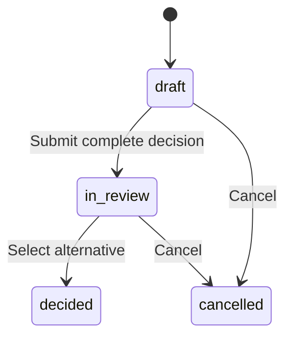
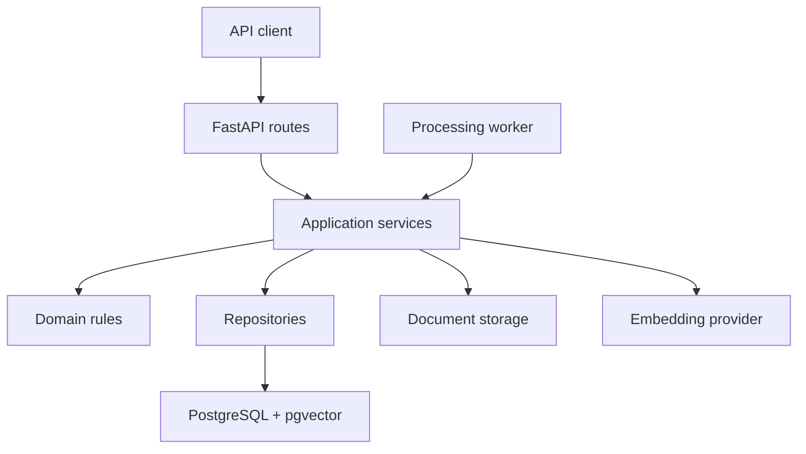

# Engineering Knowledge and Decision Workflow Platform

An API-first backend for converting engineering source documents into searchable, traceable decision records.

The platform ingests and versions documents, processes their contents asynchronously, supports semantic search with citations, and connects relevant document evidence to structured engineering decisions. Each decision preserves its alternatives, review outcome, evidence provenance, and immutable audit history.

> Current status: Stage 10 user identity, password-based registration/login, server-side session authentication, email verification, authentication rate limiting, CSRF/Origin protection, authenticated document ownership, and core decision ownership/read authorization are implemented. Nested decision mutation and review-transition authorization, identity attribution across decision workflows, frontend integration, and additional production hardening remain planned.

## Why This Project Exists

Important engineering decisions are often distributed across PDFs, reports, meeting notes, and disconnected systems. This makes it difficult to answer:

- Why was a particular alternative selected?
- Which source material supported or opposed it?
- Which document version and page contained the cited information?
- What changed during the decision process?
- When was the decision submitted, finalized, or cancelled?

This platform creates a structured decision record that connects each outcome to its source evidence and chronological history.

## Current Capabilities

### Document knowledge pipeline

- Document metadata management
- Immutable document version records
- Local file storage abstraction
- PDF text extraction
- Page and chunk persistence
- Configurable text chunking
- OpenAI embedding generation
- PostgreSQL `pgvector` storage
- Semantic document search
- Citation metadata containing document, version, page, chunk, and offsets
- Queued document-processing jobs
- Background processing worker
- Failure recording and retry support
- Concurrency-safe job claiming

### Decision workflow

- Create and retrieve decisions
- Add, update, remove, and order alternatives
- Link supporting or opposing document evidence to alternatives
- Reject evidence from documents that are not ready
- Submit complete decisions for review
- Require at least two alternatives and one evidence link before submission
- Finalize a decision with a selected alternative and rationale
- Cancel draft or in-review decisions with a rationale
- Prevent alternative and evidence changes after submission
- Retrieve a frontend-ready assembled decision record

### Auditability and integrity

- Append-only decision audit events
- Deterministic per-decision event sequencing
- JSONB event snapshots
- PostgreSQL protection against audit-event updates and deletes
- Database constraints for statuses, evidence types, ordering, and uniqueness
- Row-level locking for concurrency-sensitive decision changes
- Chronological, paginated decision history

### Identity and authentication

- Persisted user identities with normalized, unique email addresses
- Password-based registration with separately stored password credentials
- Email-verification tokens and verification workflow
- Transactional verification-email delivery through a notification-provider abstraction
- Login restricted to active, email-verified users
- Random session tokens delivered through configurable HttpOnly cookies
- Session tokens hashed before persistence rather than stored in raw form
- Server-side session expiry and logout revocation
- Authenticated current-user lookup through `GET /users/me`
- Generic resend-verification responses to avoid exposing whether an account exists

### Document authorization

- Authentication required for document creation, listing, retrieval, updates, uploads, versions, processing retries, processing status, and stored content
- Document ownership derived from the authenticated user rather than request data
- Owner-scoped document retrieval, pagination, filtering, and counts
- Cross-owner access handled as `404 Not Found` to avoid revealing resource existence
- Explicit trusted-worker lookup kept separate from browser-facing owner-scoped access

### Decision authorization

- Authentication required for decision creation, listing, retrieval, assembled records, alternative and evidence reads, and audit-history reads
- Decision ownership derived from the authenticated user rather than request data
- Owner-scoped decision retrieval, pagination, counts, assembled records, and related read endpoints
- Cross-owner access handled as `404 Not Found` to avoid revealing decision existence
- Authorization for nested mutations and review transitions remains planned

## Decision Lifecycle



A decision can be submitted only when it has:

- At least two alternatives
- At least one linked evidence citation

After submission, alternatives and evidence are treated as part of the reviewed record and cannot be changed.

The `superseded` state is represented in the domain model for a future decision-replacement workflow, but that workflow is not yet exposed through the API.

## Assembled Decision Record

The main read model is:

```http
GET /decisions/{decision_id}/record
```

It combines:

- Decision question and current status
- Selected alternative and rationale
- Submission, decision, cancellation, and supersession timestamps
- Alternatives in deterministic position order
- Supporting and opposing evidence grouped under each alternative
- Full document citation metadata
- Audit-history event count
- Link to the paginated history endpoint

All evidence for the record is loaded through one decision-wide query, avoiding an evidence query for every alternative.

The existing lightweight endpoint remains available:

```http
GET /decisions/{decision_id}
```

## Architecture



The application is separated into the following layers:

| Layer | Responsibility |
|---|---|
| `app/api/routes` | HTTP routing, request handling, response mapping, and status codes |
| `app/schemas` | Pydantic request and response contracts |
| `app/services` | Use-case orchestration and transaction-level workflows |
| `app/domain` | Business rules, state transitions, enums, and domain errors |
| `app/repositories` | SQLAlchemy persistence and query logic |
| `app/models` | Database table mappings and constraints |
| `app/workers` | Background document-processing execution |
| `app/extraction` | Document text extraction |
| `app/chunking` | Text segmentation |
| `app/embeddings` | Embedding-provider abstraction |
| `app/storage` | Document-storage abstraction |
| `app/notifications` | Transactional-email abstractions and provider integrations |

## Technology Stack

- Python 3.13
- FastAPI
- Pydantic v2
- SQLAlchemy 2
- PostgreSQL 17
- pgvector
- Alembic
- psycopg 3
- OpenAI embeddings
- pypdf
- pytest
- Ruff
- Docker Compose

## Local Development

### Prerequisites

Install:

- Python 3.13
- Docker with Docker Compose
- Git

An OpenAI API key is required for embedding generation and semantic-search functionality. The remaining persistence and decision tests can run without making real OpenAI requests.

### 1. Clone the repository

```bash
git clone https://github.com/Geocoder89/engineering-knowledge-platform.git
cd engineering-knowledge-platform
```

### 2. Create the Python environment

```bash
python3.13 -m venv .venv
source .venv/bin/activate
python -m pip install --upgrade pip
python -m pip install -r requirements-dev.txt
```

### 3. Configure the environment

```bash
cp .env.example .env
```

Update the development password and add an OpenAI API key when exercising document embeddings or search.

### CSRF and Origin protection

Unsafe browser requests using `POST`, `PUT`, `PATCH`, or `DELETE` must include
an exact trusted `Origin`. Configure trusted origins as a JSON array:

```env
CSRF_TRUSTED_ORIGINS='["http://localhost:3000"]'
CSRF_COOKIE_NAME=decision_csrf
```

Trusted origins contain only the scheme, hostname, and optional port. Do not
include paths, query strings, credentials, or trailing slashes.

Successful login issues two host-only cookies:

- `decision_session` is the `HttpOnly` authentication credential.
- `decision_csrf` is readable by the frontend and contains a separate 256-bit
  CSRF token.

For authenticated unsafe requests, the frontend must copy the
`decision_csrf` cookie value into the `X-CSRF-Token` request header. The cookie
and header must match.

Safe requests such as `GET`, `HEAD`, and `OPTIONS` do not require a CSRF token.
Registration, login, email verification, and verification resend require a
trusted Origin but do not require the CSRF header because they are
pre-authentication operations.

Origin validation is separate from CORS. Until cross-origin browser access is
configured explicitly, deploy the frontend and API behind the same origin or a
same-origin reverse proxy.

### Email-verification delivery

Email delivery is disabled unless all three Resend settings are configured:

```text
RESEND_API_KEY
EMAIL_SENDER_IDENTITY
EMAIL_VERIFICATION_URL
```

`EMAIL_VERIFICATION_URL` is the application page opened from the verification
email. It is not the backend `/auth/verify-email` endpoint. The raw verification
token is added as a `token` query parameter.

`EMAIL_DELIVERY_TIMEOUT_SECONDS` controls the outbound Resend request timeout
and defaults to 10 seconds.

Registration and resend requests return `503 Service Unavailable` when delivery
is unconfigured or the provider cannot accept the message. Provider credentials
and raw verification tokens must never be committed or logged.

Do not commit `.env`. It is excluded through `.gitignore`.

### Authentication rate limiting

Sensitive unauthenticated authentication operations use PostgreSQL-backed
fixed-window rate limits.

| Endpoint | Key | Allowance |
| --- | --- | --- |
| `/auth/login` | Normalized email | 5 requests per 15 minutes |
| `/auth/login` | Client IP | 20 requests per 15 minutes |
| `/auth/register` | Normalized email | 3 requests per hour |
| `/auth/register` | Client IP | 5 requests per hour |
| `/auth/resend-verification` | Normalized email | 3 requests per hour |
| `/auth/resend-verification` | Client IP | 10 requests per hour |
| `/auth/verify-email` | Client IP | 20 requests per 15 minutes |

Rejected requests return `429 Too Many Requests` with a `Retry-After` header.
Only scoped SHA-256 hashes of email addresses and client IP addresses are
persisted; raw identifiers are not stored in rate-limit buckets.

Client IP limits currently use the direct connection address and do not trust
forwarded-client headers. Trusted-proxy handling must be configured as part of
deployment before relying on forwarded addresses.

Logout is intentionally not rate limited because it is inexpensive and limiting
it could prevent a user from ending a session. Expired bucket cleanup and
additional edge-level traffic controls remain deployment hardening tasks.

### 4. Start PostgreSQL

```bash
docker compose up -d db
docker compose ps
```

The Docker service uses the PostgreSQL values configured in `.env`.

### 5. Apply database migrations

```bash
alembic upgrade head
alembic current
```

### 6. Start the API

```bash
uvicorn app.main:app --reload
```

The API is available at:

```text
http://127.0.0.1:8000
```

Interactive API documentation:

```text
http://127.0.0.1:8000/docs
```

Alternative OpenAPI documentation:

```text
http://127.0.0.1:8000/redoc
```

### 7. Start the document-processing worker

In a second terminal with the virtual environment activated:

```bash
python -m app.workers.document_processing
```

The API and worker use the same PostgreSQL database and document-storage configuration.

## Major API Areas

| Area | Path |
|---|---|
| Health | `/health` |
| Documents and versions | `/documents` |
| Semantic search | `/search` |
| Decisions | `/decisions` |
| Ordered alternatives | `/decisions/{decision_id}/alternatives` |
| Cited evidence | `/decisions/{decision_id}/alternatives/{alternative_id}/evidence` |
| Submit for review | `/decisions/{decision_id}/submit` |
| Finalize decision | `/decisions/{decision_id}/decide` |
| Cancel decision | `/decisions/{decision_id}/cancel` |
| Assembled record | `/decisions/{decision_id}/record` |
| Audit history | `/decisions/{decision_id}/history` |
| Registration | `/auth/register` |
| Login and logout | `/auth/login`, `/auth/logout` |
| Verify email | `/auth/verify-email` |
| Resend verification | `/auth/resend-verification` |
| Current user | `/users/me` |

The generated OpenAPI documentation provides the complete methods, payloads, validation constraints, and response schemas.

## Verification

Run the complete test suite:

```bash
python -m pytest -q
```

The project test suite covers:

- Pydantic and API validation
- Database constraints
- Repository persistence and ordering
- Document processing and retries
- Worker behavior and concurrency
- Semantic search and citations
- Decision state transitions
- Post-submission immutability
- Audit-event immutability
- Assembled-record composition
- API failure and boundary conditions
- Fixed-query evidence loading
- Registration, authentication, and email-verification workflows
- Transactional-email delivery and provider-failure handling

Run lint and formatting verification:

```bash
ruff check .
ruff format --check .
```

Verify migrations and installed dependencies:

```bash
alembic check
python -m pip check
```

## Project Structure

```text
app/
├── api/             HTTP routes and dependencies
├── chunking/        Text chunking
├── domain/          Business rules and domain types
├── embeddings/      Embedding-provider integrations
├── extraction/      PDF text extraction
├── models/          SQLAlchemy models
├── repositories/    Persistence and query logic
├── schemas/         Pydantic API contracts
├── services/        Application workflows
├── storage/         Document-storage implementations
└── workers/         Background processing workers

migrations/          Alembic database migrations
tests/               Unit, integration, API, and worker tests
```

## Roadmap

### Stage 10: Identity and authentication — implemented

- Persisted user identity
- Secure password storage
- Registration and email verification
- Password-based login for active, verified users
- Server-side session authentication using HttpOnly cookies
- Hashed session-token persistence
- Session expiry and logout revocation
- Authenticated current-user endpoint

### Resource authorization — in progress

- Document ownership and authorization — implemented
- Core decision ownership and read authorization — implemented
- Nested decision mutation and review-transition authorization — planned
- Document search and cross-resource evidence scoping — planned
- Creator and reviewer attribution — planned
- Actor identity in decision audit events — planned
- Additional abuse protection and authentication hardening — planned

### Production readiness

- Containerized API and worker services
- CI quality gates
- Environment and secret hardening
- Structured request and correlation logging
- Readiness and liveness checks
- CORS and rate-limit policies
- Deployment configuration
- Operational monitoring
- Backup and recovery planning
- Security review

### Product completion

- Frontend decision workspace
- End-to-end browser tests
- Decision supersession workflow
- Deployment and portfolio demonstration

## Current Limitations

This repository is under active development and is not yet presented as a production-ready service.

Current limitations include:

- Document and core decision ownership are enforced, but nested decision mutations, review transitions, document search, and cross-resource evidence authorization remain incomplete
- Creator/reviewer attribution and authenticated actor identity are not yet wired into decision records and audit events
- Local filesystem document storage
- No hosted deployment configuration
- No CI pipeline
- No frontend
- No operational monitoring or backup strategy
- No exposed decision-supersession workflow

These areas are intentionally tracked in the roadmap rather than represented as completed functionality.