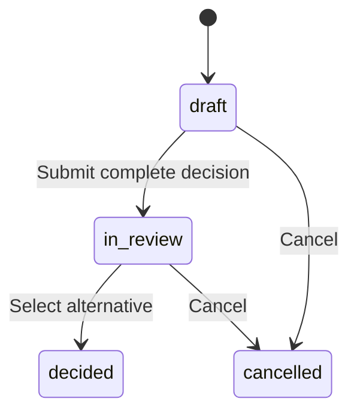
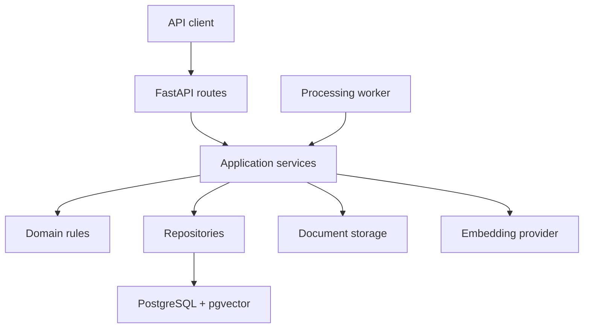

# Engineering Knowledge and Decision Workflow Platform

An API-first backend for converting engineering source documents into searchable, traceable decision records.

The platform ingests and versions documents, processes their contents asynchronously, supports semantic search with citations, and connects relevant document evidence to structured engineering decisions. Each decision preserves its alternatives, review outcome, evidence provenance, and immutable audit history.

> Current status: Stage 10 user identity, password-based registration/login, server-side session authentication, email verification, authentication rate limiting, CSRF/Origin protection, authenticated document ownership, owner-scoped semantic search, decision ownership across reads and writes, and cross-resource evidence authorization are implemented. Decision audit actor attribution and creator/finalizer attribution on decision records are also implemented. The React frontend provides registration/email verification, session-based login, a protected decision register, draft creation, saved records, and draft alternative editing. Document, search, evidence-editing, and review integration and production hardening are planned.

## Frontend workspace

The `frontend/` directory contains real account onboarding and session-based login, a protected decision register, draft creation, saved records, and draft alternative editing. The responsive sample decision, document, and search preview remains under `/preview`. See [testing draft alternatives](frontend/README.md#test-draft-alternatives) for the current end-to-end test flow.

With Node.js 24 LTS (24.16+ within 24.x) installed:

```bash
cd frontend
npm ci
npm run dev
```

Open http://127.0.0.1:5173. Login requires the local API, an existing email-verified account, and `http://127.0.0.1:5173` in the backend's `CSRF_TRUSTED_ORIGINS`. Vite forwards `/api/*` to the local API while preserving the browser Origin and cookies. See [the frontend guide](frontend/README.md) for the exact Docker/environment setup and test commands.

The public sample workspace at http://127.0.0.1:5173/preview still works without a backend. Its fictional records are separate from your account and make no embedding requests. Sample changes reset when leaving the decision screen or refreshing. CI checks both the preview and real cookie/CSRF login/logout flows against a disposable PostgreSQL database.

## Why This Project Exists

Important engineering decisions are often distributed across PDFs, reports, meeting notes, and disconnected systems. This makes it difficult to answer:

- Why was a particular alternative selected?
- Which source material supported or opposed it?
- Which document version and page contained the cited information?
- What changed during the decision process?
- When was the decision submitted, finalized, or cancelled?

This platform creates a structured decision record that connects each outcome to its source evidence and chronological history.

## Current Capabilities

### Document knowledge pipeline

- Document metadata management
- Immutable document version records
- Local file storage abstraction
- PDF text extraction
- Page and chunk persistence
- Configurable text chunking
- OpenAI embedding generation
- PostgreSQL `pgvector` storage
- Semantic document search
- Citation metadata containing document, version, page, chunk, and offsets
- Queued document-processing jobs
- Background processing worker
- Failure recording and retry support
- Concurrency-safe job claiming

### Decision workflow

- Create and retrieve decisions
- Add, update, remove, and order alternatives
- Link supporting or opposing document evidence to alternatives
- Reject evidence from documents that are not ready
- Submit complete decisions for review
- Require at least two alternatives and one evidence link before submission
- Finalize a decision with a selected alternative and rationale
- Cancel draft or in-review decisions with a rationale
- Prevent alternative and evidence changes after submission
- Record the authenticated creator as `created_by_user_id`
- Record the authenticated finalizer as `decided_by_user_id` when an outcome is selected
- Return attribution in decision responses and assembled records, preserving null values for unknown historical attribution
- Retrieve a frontend-ready assembled decision record

### Auditability and integrity

- Append-only decision audit events
- Deterministic per-decision event sequencing
- JSONB event snapshots
- PostgreSQL protection against audit-event updates and deletes
- Database constraints for statuses, evidence types, ordering, and uniqueness
- Row-level locking for concurrency-sensitive decision changes
- Chronological, paginated decision history
- Authenticated actor attribution for decision creation, alternative changes, evidence changes, submission, finalization, and cancellation
- Actor identity exposed as `actor_user_id` on each audit-history item
- Historical events without recorded attribution return `actor_user_id: null`; attribution is not inferred or backfilled
- Foreign-key protection against deletion of users referenced by audit events

### Identity and authentication

- Persisted user identities with normalized, unique email addresses
- Password-based registration with separately stored password credentials
- Email-verification tokens and verification workflow
- Transactional verification-email delivery through a notification-provider abstraction
- Login restricted to active, email-verified users
- Random session tokens delivered through configurable HttpOnly cookies
- Session tokens hashed before persistence rather than stored in raw form
- Server-side session expiry and logout revocation
- Authenticated current-user lookup through `GET /users/me`
- Generic resend-verification responses to avoid exposing whether an account exists

### Document authorization

- Authentication required for document creation, listing, retrieval, updates, uploads, versions, processing retries, processing status, and stored content
- Document ownership derived from the authenticated user rather than request data
- Owner-scoped document retrieval, pagination, filtering, and counts
- Cross-owner access handled as `404 Not Found` to avoid revealing resource existence
- Explicit trusted-worker lookup kept separate from browser-facing owner-scoped access
- Authentication and document-owner scoping enforced for semantic search results

### Decision authorization

- Authentication required across decision creation, listing, retrieval, assembled records, nested alternative and evidence operations, review transitions, and audit-history reads
- Decision ownership derived from the authenticated user rather than request data
- Owner-scoped decision retrieval, pagination, counts, assembled records, row-locking mutations, and review transitions
- Cross-owner reads and writes handled as `404 Not Found` to avoid revealing decision existence
- Unauthorized mutations leave alternatives, evidence, and decision state unchanged
- Evidence links restricted to document chunks owned by the same authenticated user

## Decision Lifecycle


```mermaid
stateDiagram-v2
    [*] --> draft
    draft --> in_review: Submit complete decision
    draft --> cancelled: Cancel
    in_review --> decided: Select alternative
    in_review --> cancelled: Cancel
```

A decision can be submitted only when it has:

- At least two alternatives
- At least one linked evidence citation

After submission, alternatives and evidence are treated as part of the reviewed record and cannot be changed.

The `superseded` state is represented in the domain model for a future decision-replacement workflow, but that workflow is not yet exposed through the API.

## Assembled Decision Record

The main read model is:

```http
GET /decisions/{decision_id}/record
```

It combines:

- Decision question and current status
- Selected alternative and rationale
- Submission, decision, cancellation, and supersession timestamps
- Alternatives in deterministic position order
- Supporting and opposing evidence grouped under each alternative
- Full document citation metadata
- Audit-history event count
- Link to the paginated history endpoint
- Creator and finalizer user IDs, where recorded

All evidence for the record is loaded through one decision-wide query, avoiding an evidence query for every alternative.

The existing lightweight endpoint remains available:

```http
GET /decisions/{decision_id}
```

## Architecture


```mermaid
flowchart TD
    Client["API client"] --> API["FastAPI routes"]
    API --> Services["Application services"]
    Worker["Processing worker"] --> Services
    Services --> Domain["Domain rules"]
    Services --> Repositories["Repositories"]
    Repositories --> Database["PostgreSQL + pgvector"]
    Services --> Storage["Document storage"]
    Services --> Embeddings["Embedding provider"]
```

The application is separated into the following layers:

| Layer | Responsibility |
|---|---|
| `app/api/routes` | HTTP routing, request handling, response mapping, and status codes |
| `app/schemas` | Pydantic request and response contracts |
| `app/services` | Use-case orchestration and transaction-level workflows |
| `app/domain` | Business rules, state transitions, enums, and domain errors |
| `app/repositories` | SQLAlchemy persistence and query logic |
| `app/models` | Database table mappings and constraints |
| `app/workers` | Background document-processing execution |
| `app/extraction` | Document text extraction |
| `app/chunking` | Text segmentation |
| `app/embeddings` | Embedding-provider abstraction |
| `app/storage` | Document-storage abstraction |
| `app/notifications` | Transactional-email abstractions and provider integrations |

## Technology Stack

- Python 3.13
- FastAPI
- Pydantic v2
- SQLAlchemy 2
- PostgreSQL 17
- pgvector
- Alembic
- psycopg 3
- OpenAI embeddings
- pypdf
- pytest
- Ruff
- Docker Compose

## Local Development

### Prerequisites

Install:

- Python 3.13
- Docker with Docker Compose
- Git

An OpenAI API key is required for embedding generation and semantic-search functionality. The remaining persistence and decision tests can run without making real OpenAI requests.

### 1. Clone the repository

```bash
git clone https://github.com/Geocoder89/engineering-knowledge-platform.git
cd engineering-knowledge-platform
```

### 2. Create the Python environment

```bash
python3.13 -m venv .venv
source .venv/bin/activate
python -m pip install --upgrade pip
python -m pip install -r requirements-dev.txt
```

### 3. Configure the environment

```bash
cp .env.example .env
```

Update the development password and add an OpenAI API key when exercising document embeddings or search.

### CSRF and Origin protection

Unsafe browser requests using `POST`, `PUT`, `PATCH`, or `DELETE` must include
an exact trusted `Origin`. Configure trusted origins as a JSON array:

```env
CSRF_TRUSTED_ORIGINS='["http://localhost:3000","http://127.0.0.1:5173","http://localhost:5173"]'
CSRF_COOKIE_NAME=decision_csrf
```

Trusted origins contain only the scheme, hostname, and optional port. Do not
include paths, query strings, credentials, or trailing slashes.

Successful login issues two host-only cookies:

- `decision_session` is the `HttpOnly` authentication credential.
- `decision_csrf` is readable by the frontend and contains a separate 256-bit
  CSRF token.

For authenticated unsafe requests, the frontend must copy the
`decision_csrf` cookie value into the `X-CSRF-Token` request header. The cookie
and header must match.

Safe requests such as `GET`, `HEAD`, and `OPTIONS` do not require a CSRF token.
Registration, login, email verification, and verification resend require a
trusted Origin but do not require the CSRF header because they are
pre-authentication operations.

Origin validation is separate from CORS. Until cross-origin browser access is
configured explicitly, deploy the frontend and API behind the same origin or a
same-origin reverse proxy.

### Email-verification delivery

Email delivery is disabled unless all three Resend settings are configured:

```text
RESEND_API_KEY
EMAIL_SENDER_IDENTITY
EMAIL_VERIFICATION_URL
```

`EMAIL_VERIFICATION_URL` is the application page opened from the verification
email. It is not the backend `/auth/verify-email` endpoint. The raw verification
token is added as a `token` query parameter.

The frontend now provides `/register`, `/verify-email`, and `/resend-verification`. For local delivery, use `EMAIL_VERIFICATION_URL=http://127.0.0.1:5173/verify-email`. See [frontend onboarding tests](frontend/README.md#test-account-onboarding) for a disposable, no-email local test and real delivery instructions.

`EMAIL_DELIVERY_TIMEOUT_SECONDS` controls the outbound Resend request timeout
and defaults to 10 seconds.

Registration and resend requests return `503 Service Unavailable` when delivery
is unconfigured or the provider cannot accept the message. Provider credentials
and raw verification tokens must never be committed or logged.

Do not commit `.env`. It is excluded through `.gitignore`.

### Authentication rate limiting

Sensitive unauthenticated authentication operations use PostgreSQL-backed
fixed-window rate limits.

| Endpoint | Key | Allowance |
| --- | --- | --- |
| `/auth/login` | Normalized email | 5 requests per 15 minutes |
| `/auth/login` | Client IP | 20 requests per 15 minutes |
| `/auth/register` | Normalized email | 3 requests per hour |
| `/auth/register` | Client IP | 5 requests per hour |
| `/auth/resend-verification` | Normalized email | 3 requests per hour |
| `/auth/resend-verification` | Client IP | 10 requests per hour |
| `/auth/verify-email` | Client IP | 20 requests per 15 minutes |

Rejected requests return `429 Too Many Requests` with a `Retry-After` header.
Only scoped SHA-256 hashes of email addresses and client IP addresses are
persisted; raw identifiers are not stored in rate-limit buckets.

Client IP limits currently use the direct connection address and do not trust
forwarded-client headers. Trusted-proxy handling must be configured as part of
deployment before relying on forwarded addresses.

Logout is intentionally not rate limited because it is inexpensive and limiting
it could prevent a user from ending a session. Expired bucket cleanup and
additional edge-level traffic controls remain deployment hardening tasks.

### 4. Start PostgreSQL

```bash
docker compose up -d db
docker compose ps
```

The Docker service uses the PostgreSQL values configured in `.env`.

### 5. Apply database migrations

```bash
alembic upgrade head
alembic current
```

### 6. Start the API

```bash
uvicorn app.main:app --reload --no-access-log
```

The API is available at:

```text
http://127.0.0.1:8000
```

Interactive API documentation:

```text
http://127.0.0.1:8000/docs
```

Alternative OpenAPI documentation:

```text
http://127.0.0.1:8000/redoc
```

### 7. Start the document-processing worker

In a second terminal with the virtual environment activated:

```bash
python -m app.workers.document_processing
```

The API and worker use the same PostgreSQL database and document-storage configuration.

### Alternative: run the backend in containers

This option needs Git and Docker Compose v2; host Python is not required. From
a fresh checkout, copy `.env.example` to `.env` and configure the settings above.
The API and worker share one Python 3.13 image and run as a non-root user.

```bash
docker compose build api
docker compose run --rm migrate
docker compose up -d --wait api worker
docker compose ps
curl --fail http://127.0.0.1:8000/health
```

The migration command starts PostgreSQL, waits for its health check, and applies
Alembic migrations as a separate one-off operation. Continue to startup only when
it succeeds. Neither the API nor the worker applies migrations on startup. After
pulling code changes, rebuild the image and run the migration command before
recreating the application services.

The worker requires a real `OPENAI_API_KEY` at startup. To run only the API and
database without an embedding key, use `docker compose up -d --wait api` instead.
Embedding generation and semantic search require the key; registration and
verification resend still require the three email delivery settings documented
above. Container startup alone does not configure either external provider.

Compose loads runtime settings from `.env`, overrides `DATABASE_URL` to use
`db:5432`, and fixes `DOCUMENT_STORAGE_PATH` to `/app/var/document-storage`.
The host Python workflow continues to use the `localhost` URL in `.env`. If the
database password contains URL-sensitive characters, set `CONTAINER_DATABASE_URL`
with a percent-encoded password, as shown in `.env.example`. Set `API_PORT` to
change the host API port. API and PostgreSQL ports bind to loopback for local use.

Database records live in the existing `postgres_data` named volume. Uploaded
files live in a separate `document_storage` named volume mounted at the same path
in both application services. Existing files under the host's
`var/document-storage` are not copied automatically. When switching an existing
database from host Python to containers, copy its documents into the named volume
before processing or downloading them; do not run host and container workers
against that database with different storage directories.

```bash
# With the application services stopped, copy existing host documents if needed:
docker compose stop api worker
docker compose run --rm --no-deps \
  -v "$(pwd)/var/document-storage:/source:ro" api \
  python -c 'import shutil; shutil.copytree("/source", "/app/var/document-storage", dirs_exist_ok=True)'
docker compose up -d --wait api worker
```

Useful operational commands:

```bash
docker compose logs -f api worker
docker compose run --rm migrate python -m alembic current
docker compose run --rm migrate python -m alembic check
docker compose down
```

`docker compose down` preserves both named volumes. **Adding `--volumes` deletes
the database and uploaded documents.** Persistent volumes are not backups. Keep
the Compose project name stable so subsequent runs attach to the same volumes.
The worker has 60 seconds to finish its current operation after a stop signal;
this does not guarantee recovery of interrupted long-running jobs.

The API container health check uses `/ready` to verify database connectivity.
Proxy headers are disabled until a trusted reverse proxy is configured. This
setup is for local development and verification; hosted deployment and TLS remain
future work.

### Liveness, readiness and request diagnostics

| Endpoint | Success | Failure | Purpose |
| --- | --- | --- | --- |
| `GET /health` | `200 {"status":"ok"}` | API cannot respond | Process liveness; does not access PostgreSQL |
| `GET /ready` | `200 {"status":"ready"}` | `503 {"status":"unavailable"}` | PostgreSQL connectivity and a successful `SELECT 1` |

Both probes are unauthenticated. Readiness responses include `Cache-Control:
no-store` and never include database exception details. The readiness probe uses
a fresh connection with a two-second connection timeout and a one-second
PostgreSQL statement timeout, independently of the normal request connection
pool. These are component timeouts, not a strict total request deadline. Readiness
does not validate migrations, application pool capacity, document storage, worker
progress, email delivery or embedding-provider availability.

Every HTTP request gets a new server-generated UUID in `X-Request-ID`. Incoming
request IDs are ignored. The same ID is available as `request.state.request_id`
and appears in one JSON request log entry, including handled errors, CSRF
rejections and unexpected errors. Unexpected errors before response headers are
sent return a generic `500` response with the ID; exceptions still propagate to
the server. For streaming responses, the logged status is the status already
sent, even if an error occurs later.

The `app.requests` logger writes JSON to stderr with `timestamp`, `level`,
`event`, `request_id`, `method`, `path`, `status_code`, `duration_ms` and
`error_type`. Duration covers application handling through response completion
and any background work awaited by the application. The path is the matched
route template, such as `/documents/{document_id}`, rather than the actual
resource identifier. Requests rejected before routing and unknown paths use
`<unmatched>`.

Request logs exclude query strings, headers, cookies, bodies, client IP addresses
and exception messages. The Docker command and the local command above disable
Uvicorn's separate access log, which otherwise includes raw URLs. Server error
tracebacks and third-party logs are separate; review their handling before public
deployment. Detailed operational monitoring and centralized logging remain
future work.

```bash
curl -i http://127.0.0.1:8000/ready
docker compose logs --no-log-prefix api
```

To investigate a request, find its response's `X-Request-ID` in the JSON logs.
The request logger records diagnostic events; decision audit events remain the
separate persistent record of who changed a decision.

## Major API Areas

| Area | Path |
|---|---|
| Health | `/health` |
| Documents and versions | `/documents` |
| Semantic search | `/search` |
| Decisions | `/decisions` |
| Ordered alternatives | `/decisions/{decision_id}/alternatives` |
| Cited evidence | `/decisions/{decision_id}/alternatives/{alternative_id}/evidence` |
| Submit for review | `/decisions/{decision_id}/submit` |
| Finalize decision | `/decisions/{decision_id}/decide` |
| Cancel decision | `/decisions/{decision_id}/cancel` |
| Assembled record | `/decisions/{decision_id}/record` |
| Audit history | `/decisions/{decision_id}/history` |
| Registration | `/auth/register` |
| Login and logout | `/auth/login`, `/auth/logout` |
| Verify email | `/auth/verify-email` |
| Resend verification | `/auth/resend-verification` |
| Current user | `/users/me` |

The generated OpenAPI documentation provides the complete methods, payloads, validation constraints, and response schemas.

## Verification

GitHub Actions runs `.github/workflows/ci.yml` for pull requests targeting `master` and pushes to `master`. It checks dependency compatibility, Ruff lint and formatting, migration application and schema consistency, and the pytest suite using PostgreSQL 17 with pgvector.

A separate container job builds the runtime image, applies migrations, starts the
API and worker, checks non-root execution and shared document storage, and
recreates containers to verify database and file persistence. Its dummy embedding
key and loopback provider URL prevent paid embedding calls. This infrastructure
smoke test does not replace an end-to-end upload/search workflow test.
It also stops PostgreSQL to verify `/health` stays live while `/ready` returns
`503`, then restarts PostgreSQL and checks that readiness recovers.

Run the complete test suite:

```bash
python -m pytest -q
```

The project test suite covers:

- Pydantic and API validation
- Database constraints
- Repository persistence and ordering
- Document processing and retries
- Worker behavior and concurrency
- Semantic search and citations
- Decision state transitions
- Post-submission immutability
- Audit-event immutability
- Actor attribution across decision audit writes
- Audit-history API responses containing authenticated actor IDs
- Historical audit events returning null actor attribution
- Assembled-record composition
- API failure and boundary conditions
- Fixed-query evidence loading
- Registration, authentication, and email-verification workflows
- Transactional-email delivery and provider-failure handling
- Creator attribution on creation and finalizer attribution on finalization
- Persisted finalizer identity and attribution in assembled decision records
- Historical decisions retaining null attribution without inferred backfills

### Complete backend workflow test

`tests/test_backend_workflow.py` connects the main backend journey in one
integration test:

1. Register through the API, verify email using the token captured by the test
   email sender, and log in with real password/session authentication.
2. Create a document and upload a two-page PDF using the session and CSRF cookies.
3. Run one real worker iteration to claim the queued job, extract PDF text, chunk
   it, generate controlled embeddings and persist the result in PostgreSQL.
4. Search with pgvector, rank the relevant page above a distractor, and retain its
   source citation when attaching evidence to a decision alternative.
5. Submit and finalize the decision, then inspect its assembled record, creator
   and finalizer attribution, and ordered actor-attributed audit history.
6. Log out and sign in as another registered user; confirm that the original
   document, download, processing status, evidence, record and history are hidden
   and that search returns none of the first user's content.

The test also checks unauthenticated access, login before email verification,
invalid CSRF protection and submission of an incomplete decision. It does not
bypass authentication or seed decisions/chunks directly into the database.

With the development virtual environment active and `.env` configured for the
host PostgreSQL connection:

```bash
docker compose up -d --wait db
python -m alembic upgrade head
python -m pytest tests/test_backend_workflow.py -vv
```

The configured PostgreSQL database must have pgvector installed by migrations,
and the test role needs permission to create schemas. The test creates its tables
from model metadata inside a uniquely named schema and the existing outer
rollback transaction, with uploads in a temporary directory. This keeps the
worker away from pre-existing processing jobs; rollback removes the test schema
and records. The API and worker use separate SQLAlchemy sessions on the shared
test connection, with savepoints instead of independent committed connections.
Migration correctness and container lifecycle are checked separately in CI.

Email delivery is captured in memory and embeddings use two deterministic test
vectors. No real email or embedding requests are made, and no provider keys or
running worker process are needed. The test exercises retrieval and citation
wiring, not semantic model quality. It uses FastAPI's in-process TestClient and
one worker iteration; it does not cover browser UI, deployed networking or
cross-process queue concurrency. Those boundaries retain their separate tests or
deployment checks. The existing CI quality job includes this test automatically.

Run lint and formatting verification:

```bash
ruff check .
ruff format --check .
```

Verify migrations and installed dependencies:

```bash
alembic check
python -m pip check
```

## Project Structure

```text
app/
├── api/             HTTP routes and dependencies
├── chunking/        Text chunking
├── domain/          Business rules and domain types
├── embeddings/      Embedding-provider integrations
├── extraction/      PDF text extraction
├── models/          SQLAlchemy models
├── repositories/    Persistence and query logic
├── schemas/         Pydantic API contracts
├── services/        Application workflows
├── storage/         Document-storage implementations
└── workers/         Background processing workers

migrations/          Alembic database migrations
tests/               Unit, integration, API, and worker tests
```

## Roadmap

### Stage 10: Identity and authentication — implemented

- Persisted user identity
- Secure password storage
- Registration and email verification
- Password-based login for active, verified users
- Server-side session authentication using HttpOnly cookies
- Hashed session-token persistence
- Session expiry and logout revocation
- Authenticated current-user endpoint

### Resource authorization — in progress

- Document ownership and authorization — implemented
- Document search authorization and cross-resource evidence scoping — implemented
- Decision ownership, nested mutation authorization, and review-transition authorization — implemented
- Actor identity in decision audit events and audit-history responses — implemented
- Creator and finalizer attribution on decision records — implemented
- Additional abuse protection and authentication hardening — planned

### Production readiness

- Containerized API and worker services — implemented with explicit migrations and persistent shared document storage
- GitHub Actions CI quality gates — implemented
- Environment and secret hardening
- Structured JSON request logging and server-generated request IDs — implemented
- Basic API liveness endpoint — implemented at `/health`
- Database connectivity readiness check — implemented at `/ready`
- Authentication endpoint rate limiting — implemented
- Cross-origin browser configuration and deployment-level traffic controls — planned
- Deployment configuration
- Operational monitoring
- Backup and recovery planning
- Security review

### Product completion

- Frontend decision workspace
- End-to-end browser tests
- Decision supersession workflow
- Deployment and portfolio demonstration

## Current Limitations

This repository is under active development and is not yet presented as a production-ready service.

Current limitations include:

- Historical decisions may lack creator or finalizer attribution; unknown identities remain null
- Local filesystem document storage
- No hosted deployment configuration
- Live frontend document upload/search, evidence editing, review transitions, and detailed audit-history browsing remain pending; onboarding, decision records, and draft alternative editing are integrated
- No operational monitoring or backup strategy
- No exposed decision-supersession workflow

These areas are intentionally tracked in the roadmap rather than represented as completed functionality.
